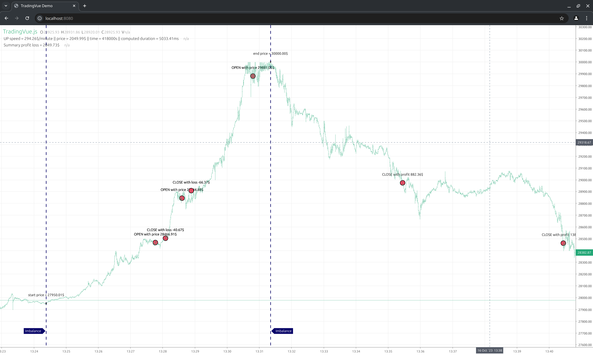

## bybit-trade-app

Главное происходит в Strategy и ImbalanceService:
* Strategy отвечает за то какие сделки открывать, стоп лосс, тейк профит. Закрытие по таймауту и отслеживание открытых позиций.
* ImbalanceService отвечает за то, когда открывать сделку.

## 
Остальные файлы нужны только для проведения бэк-теста: 
* ExchangeSimulator - симулятор биржи. Можно создавать рыночные или лимитные ордера. Можно закрывать позиции принудительно или по лимитной цене. Введены комиссии. 
* MarketDataLoader - для загрузки исторических данных. 
* Account - для отслеживания баланса аккаунта во время бэк-теста. Есть кредитное плечо.

##
Для удобства отображения в UI можно:
1. Поставить https://github.com/tvjsx/trading-vue-js, запустить c "npm run dev"
2. Поставить брейки в Strategy#123 и Strategy#142 (обе строки System.out.print("");)
3. Указать правильную тайм-зону в Log.ZONE_OFFSET
4. Указать правильный путь к trading-vue-js файлу data.json в JsonUtils.DATA_JSON_FILE_PATH
5. Запустить бэктест с дебагом
6. Открыть localhost:8080

На каждом брейке будет обновляться data.json и картинка. На картинке отобразятся имбаланс и открытые на его основе сделки:
